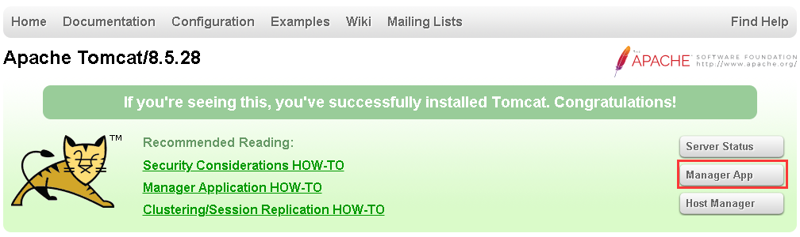
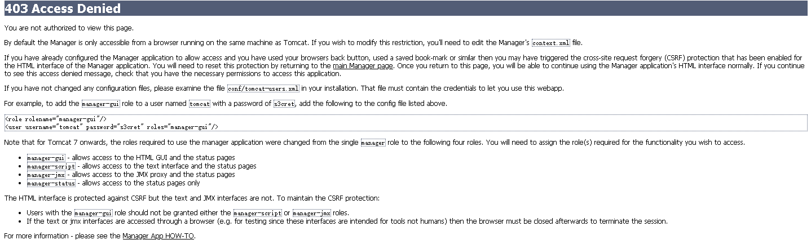

### 问题描述： ###

本机配置的GeoSmarter环境，进入Tomcat的Manager App报错403，如图：

 

### 解决方法： ###
在\GeoSmarter\server\conf\Catalina\localhost下添加一个manager.xml文件，文件内容如下：  

    <Context privileged="true" antiResourceLocking="false"   
         docBase="${catalina.home}/webapps/manager">  
    <Valve className="org.apache.catalina.valves.RemoteAddrValve" allow="^.*$" />  
    </Context>

