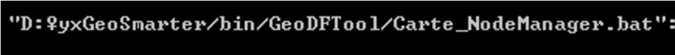
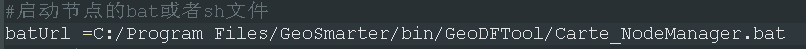

### 问题描述： ###
2、	计算中心节点启动如果，控制台报错找不到Carte_NodeManager.bat文件，且显示路径与下图相似

### 解决方法 ###
修改\GeoSmarter\server\webapps\NodeManagerTool\WEB-INF\classes\目录下config.properties(老版本为user_config.properties)文件中的“\”统一改为“/”。
